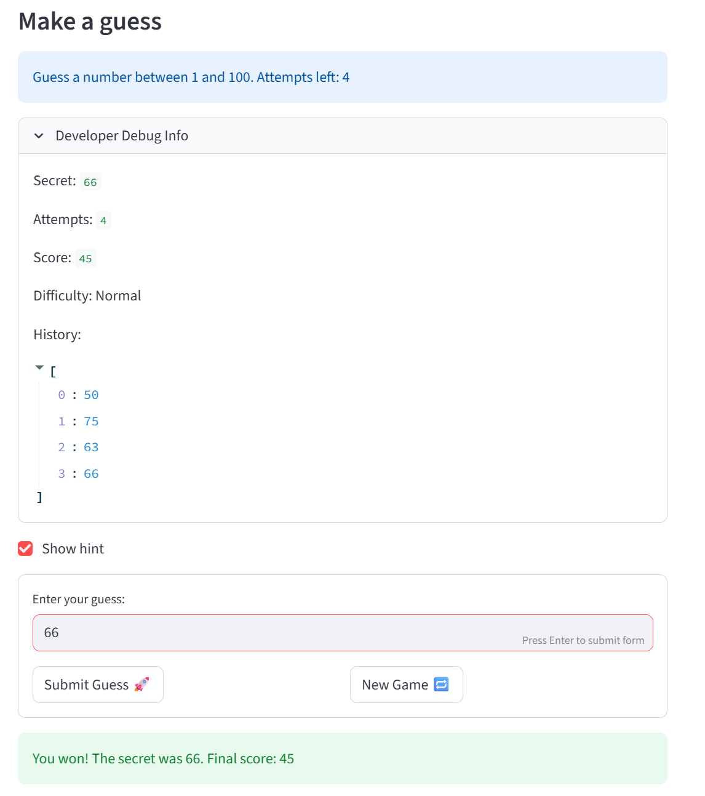

# 🎮 Game Glitch Investigator: The Impossible Guesser

## 🚨 The Situation

You asked an AI to build a simple "Number Guessing Game" using Streamlit.
It wrote the code, ran away, and now the game is unplayable. 

- You can't win.
- The hints lie to you.
- The secret number seems to have commitment issues.

## 🛠️ Setup

1. Install dependencies: `pip install -r requirements.txt`
2. Run the broken app: `python -m streamlit run app.py`

## 🕵️‍♂️ Your Mission

1. **Play the game.** Open the "Developer Debug Info" tab in the app to see the secret number. Try to win.
2. **Find the State Bug.** Why does the secret number change every time you click "Submit"? Ask ChatGPT: *"How do I keep a variable from resetting in Streamlit when I click a button?"*
3. **Fix the Logic.** The hints ("Higher/Lower") are wrong. Fix them.
4. **Refactor & Test.** - Move the logic into `logic_utils.py`.
   - Run `pytest` in your terminal.
   - Keep fixing until all tests pass!

## 📝 Document Your Experience

- [ ] Describe the game's purpose.
The game's purpose is to have the user find a secret number hidden in a certain range. Using hints allows the user to use binary search or have a better idea on what numbers to guess since the hints will instruct the user to go Higher or Lower. Different difficulties have different guessing ranges and number of attempts.
- [ ] Detail which bugs you found.
Found multiple bugs:
1. Hint displayed "Go HIGHER" when guess was too high, "Go LOWER" when too low
2. Secret compared as a string on every even attempt, causing alphabetical instead of numeric comparison
3. Submit button required two clicks after changing the input value
4. New game only reset attempts and secret, leaving status, history, and score from the previous game
5. New game always generated a secret between 1–100 regardless of difficulty
6. Initial attempts value was 1 on first load but 0 after new game
7. Game logic was mixed into app.py with UI code
- [ ] Explain what fixes you applied.
1. Swapped the return messages in check_guess in logic_utils.py
2. Removed the odd/even type-switching block; secret is always passed as an int
3. Wrapped input and buttons in st.form to batch interactions into a single rerun
4. Added resets for status, history, and score in the new game block
5. Changed randint(1, 100) to use low, high from the selected difficulty
6. Changed the initial session state value to 0 to match new game reset
7. Moved all four functions into logic_utils.py and imported them in app.py

## 📸 Demo

- [ ] [Insert a screenshot of your fixed, winning game here]

## 🚀 Stretch Features

- [ ] [If you choose to complete Challenge 4, insert a screenshot of your Enhanced Game UI here]
